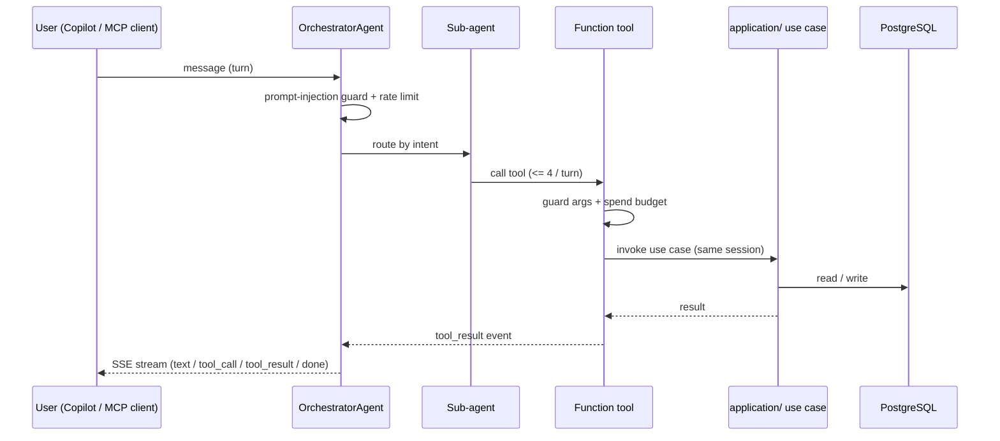

# Agent Architecture

SeftFlow Copilot is a small multi-agent system built on Google ADK. It sits on top of the existing `application/` layer and reuses the same use cases as the web UI, so there is a single source of truth for business logic.

## Components

| Layer | Module | Responsibility |
| --- | --- | --- |
| Orchestrator | `agent/orchestrator.py` | Root `LlmAgent` (Gemini 2.5 Flash); routes turns, runs the ADK Runner, streams events. |
| Sub-agents | `agent/subagents.py` | `CopywriterAgent`, `ArtDirectorAgent`. |
| Prompts | `agent/prompts.py` | System prompts for the orchestrator and sub-agents. |
| Tools | `agent/tools.py` | Function tools wrapping `application/` use cases. |
| Guards | `agent/guards.py` | Prompt-injection guard, per-turn tool-call quota, Redis rate limit. |
| Transport (HTTP) | `presentation/routes/agent.py` | `POST /api/agent/chat` (SSE), `GET /api/agent/sessions/{id}`. |
| Transport (MCP) | `mcp_server/server.py` | stdio server exposing the same tools + read-only resources. |

## Tool surface

```
list_products(limit, page)
get_workflow_status(product_id)
create_product(name, category?, price?, source_note?)
generate_copy(product_id, style?, instruction?)
generate_image(prompt, product_id?, size?, n?, image_session_id?)
add_to_gallery(image_session_asset_id)
run_product_workflow(product_id)
```

Read-only MCP resources: `productflow://products`, `productflow://gallery`.

## Data flow



## Fallback mode

When `GEMINI_API_KEY` is absent, `run_agent_turn` uses a deterministic heuristic router (`_fallback_turn`) that picks a tool by keyword and returns a trace-only response. This keeps tests and MCP smoke checks free of external LLM calls while still exercising tools and guards end to end.

## Sessions

v1 uses ADK `InMemorySessionService`, keyed by the existing cookie session (`agent_session`). History is not persisted across process restarts.